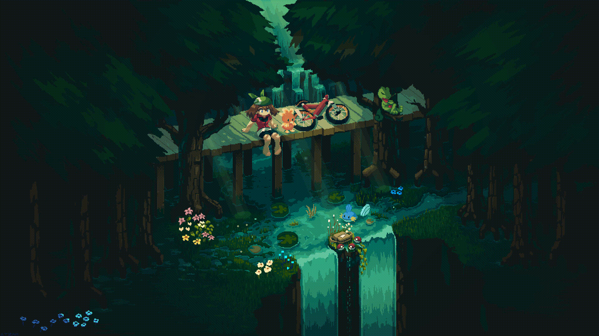
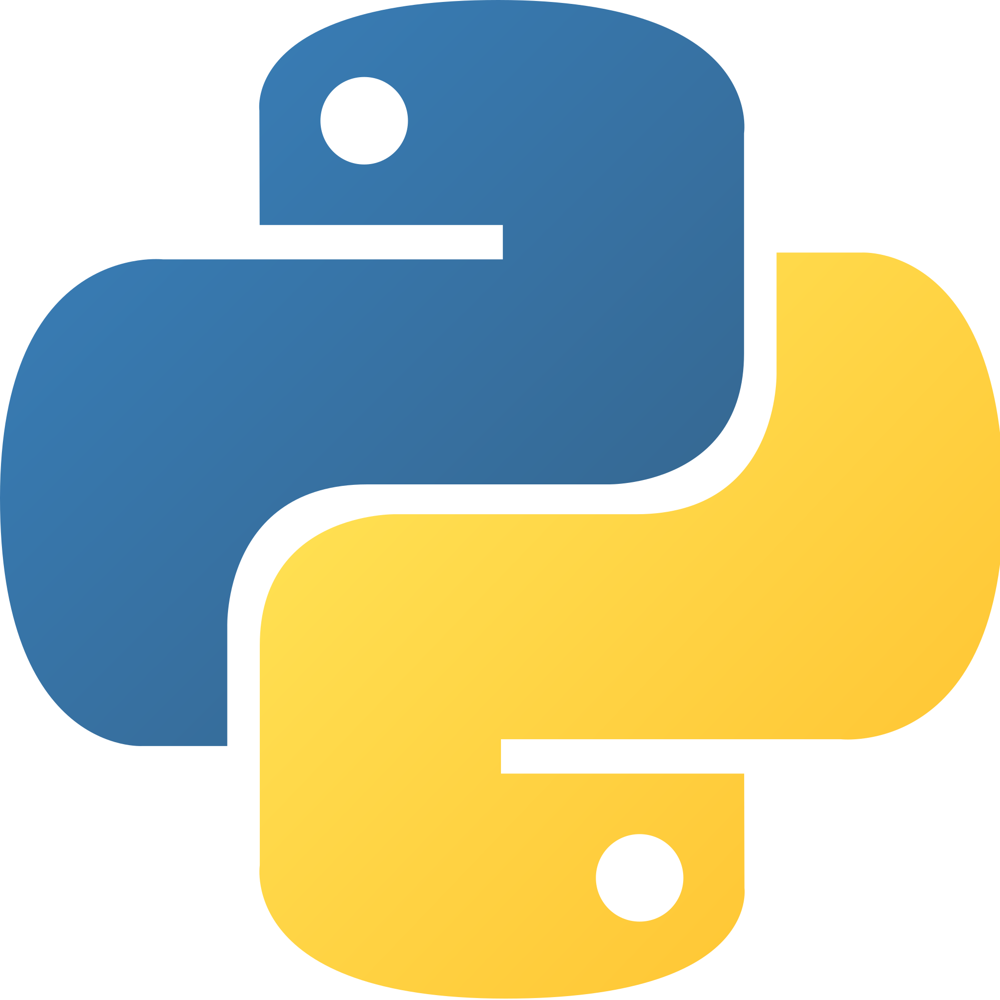

<h1 align="center"> Social Media: </h1>
  

    
    
    
  

</h1>

<!-- Description about me -->
<h2 align="center"> 🤔 About me 👨‍💻 </h2>

Hello!!!  
I am <b>Nguyen Hoang Anh</b> better known as 'Phatker'🕵🏼‍♂️  
I am from <strong>Vietnam</strong> 
I'm a guy who love develop new things 🖥️  
So... I am more than a robot coding 🤖, I am a real human trying to learn new things and develop incredible projects with ❤️ meeting incredible people on the way🚀 
If you are interested in a guy with a good vibe who loves the knowledge and the constant learning 📚, <b>⚙️I AM YOUR GUY⚙️</b>  
Contact me for new projects 📨, I am open to collaborate with you
   

### 🧐 More About Me:
<table style="border: none;">
  <tr style="border: none;">
    <td style="border: none;">
      <ul>
        <li>
          🔭 I’m currently studying at Vazuta
        </li>
    </td>
    <td style="border: none;">
      <!--  -->
    </td>
  </tr>
</table>
   

<!-- languajes and skills section -->

<h1 align="center"> Languages/Frameworks I'm good at: </h1>

  <code></code>
  <code></code>
  <code></code>
  <code></code>
  <code></code>
  <code></code>
  <code></code>
  <code></code>
  <code></code>
  <code></code>
  <code></code>

 

<h1 align="center"> Languages/Frameworks I'm learning: </h1>

  <code></code>
  <code></code>
  <code></code>
  <code></code>
  <code></code>
  <code></code>

 

<h1 align="center"> Environments I work with: </h1>

  <code></code>
  <code></code>
  <code></code>
  <code></code>

 

<!-- GitHub stats section -->

## 📊 Github stats

<!-- Bassed on: https://github.com/anuraghazra/github-readme-stats -->

   
  
  
   
  <b>Note:</b> Top languages is only a metric of the languages my public code consists of and doesn't reflect experience or skill level.

  

<!-- last activity section -->

